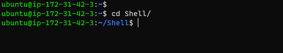

## Step1 

## Shell scripting

`mkdir Shell`

`cd Shell`

`touch names.csv and keys`

`touch & view names`

`group add developers`

`created user view`

`login to created user`

`view ls creater user`

`second created user login`

